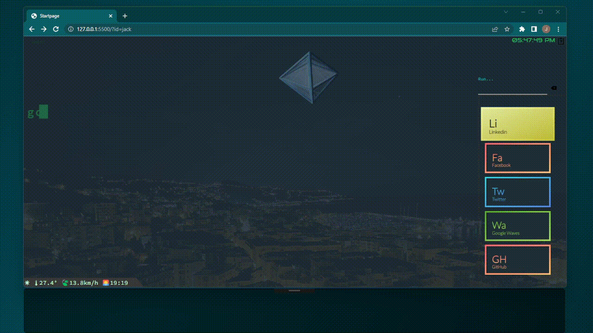

# Daghe start page

fast userful personal start page:

  

###  Features

  

- Store your URLs, with a tooltip

- Fast search URLs (and in tooltips) and open with enter (also select with arrow, use just your keyboard)

- Fast command like **g:** for search in *Google* or **d:** for *DuckDuckGO*, **y:** for *Youtube* and more

- Weather in the corner

- Nickname if you add to your URL: ?id=your_name

  

---

  

###  Configuration

Configuration files are in **data** folder.

  
Create a data/**conf.js** file with latitude and longitude, for example:

  

    let latitude = 41.9027;
    let longitude = 12.4963;
    let areaName = "Rome";
    let timearea = "Europe";
    let timezone = "Berlin";

  

Copy data/data-dist.json to data/**data.json** and put all your links, for example:

    [{
    "title": "Li",
    "desc": "Linkedin",
    "tooltip": "tooltip sample",
    "color": "yellow",
    "url": "https://www.linkedin.com"
    }, {
    "title": "Fa",
    "desc": "Facebook",
    "tooltip": "tooltip sample2",
    "color": "red",
    "url": "https://www.facebook.com"
    }, {
    "title": "Tw",
    "desc": "Twitter",
    "tooltip": "tooltip sample3",
    "color": "blue",
    "url": "https://www.twitter.com"
    }, {
    "title": "Wa",
    "desc": "Google Waves",
    "tooltip": "tooltip sample4",
    "color": "green",
    "url": "https://www.youtube.com/watch?v=dQw4w9WgXcQ"
    }, {
    "title": "GH",
    "desc": "GitHub",
    "tooltip": "yeah science Lorem ipsum carciofi yeah Lorem ipsum carciofi yeah Lorem ipsum yeah lorem ipsum carciofi yeah",
    "color": "red",
    "url": "https://www.github.com"
    }]

  
  

----

  

###  ToDo list

 - [x] filter and launch link
 - [x] better look?
 - [x] cooler animated (looped?) GIF
 - [x] different timezone for weather
 - [x] loader
 - [ ] mobile ? is needed?
 - [ ] todo list (saved in a simple localstorage)
 - [x] better -dist files logic
 - [ ] new GIF?

  

----

  

####  Inspiration and others

- [Oliviale](https://github.com/oliviale) for Periodic table style
- Background picture is https://www.pexels.com/it-it/foto/italy-sanremo-13659550/
- Github corners are made by https://tholman.com/github-corners/
- Presentation video show Keys pressed thanks to https://github.com/AxDSan/KeyPose